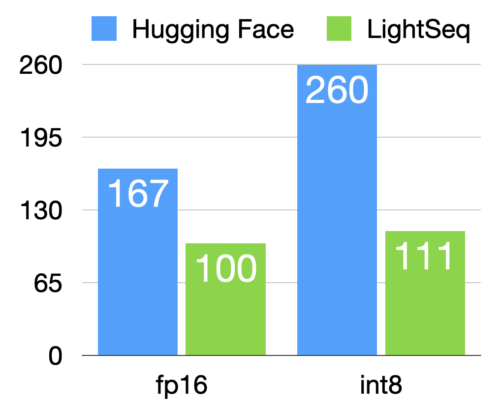
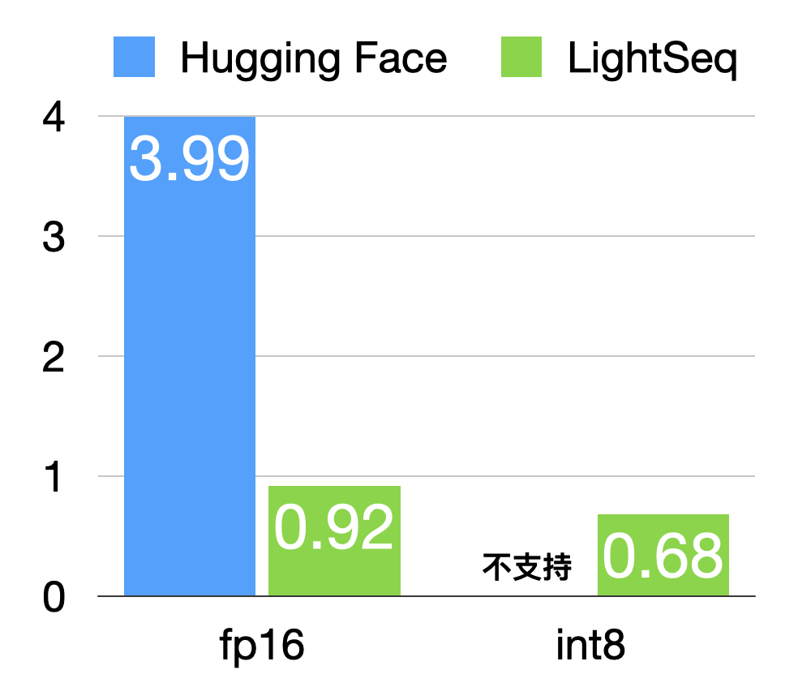

# 给我三分钟，教会你如何用量化加速模型训练和推理

## 速度对比
A100显卡上的训练总时间（秒）：  



T4显卡上生成长度500的一句话的推理时间（毫秒）:  



## fp16训练和推理

### 用fp16精度pretrain模型
训练数据`train.txt`里面，一行一段话，大概500字左右。也可以替换成你自己的语料，我这里是某知名水友的群聊语录。
```shell
python3 -m torch.distributed.launch \
    --nproc_per_node=8 \
    train.py \
    --model_name_or_path uer/gpt2-chinese-cluecorpussmall \
    --train_file data/train.txt \
    --per_device_train_batch_size 16 \
    --per_device_eval_batch_size 8 \
    --num_train_epochs 150 \
    --learning_rate 1.5e-4 \
    --output_dir model/fp16 \
    --overwrite_output_dir \
    --fp16 \
    --logging_steps 10 \
    --enable_quant false
```

### 导出fp16模型
这里`-l`可以指定生成的最大长度。
```shell
python3 export.py \
    -m model/fp16/pytorch_model.bin \
    -l 500
```

### 用fp16模型生成句子
这里`-p`用来指定词表所在的路径。
```shell
python3 generate.py \
    -m model/fp16/pytorch_model.hdf5 \
    -i "我好难受" \
    -p "uer/gpt2-chinese-cluecorpussmall"
```

## int8训练和推理

### 用fp16精度pretrain模型
第一步跟刚刚fp16训练一样，先预训练一个fp16的模型，这样能避免int8效果损失。
```shell
python3 -m torch.distributed.launch \
    --nproc_per_node=8 \
    train.py \
    --model_name_or_path uer/gpt2-chinese-cluecorpussmall \
    --train_file data/train.txt \
    --per_device_train_batch_size 16 \
    --per_device_eval_batch_size 8 \
    --num_train_epochs 150 \
    --learning_rate 1.5e-4 \
    --output_dir model/fp16 \
    --overwrite_output_dir \
    --fp16 \
    --logging_steps 10 \
    --enable_quant false
```

### 用int8精度finetune模型
然后在刚刚预训练的fp16模型基础上，用int8再finetune一会儿。
```shell
python3 -m torch.distributed.launch \
    --nproc_per_node=8 \
    train.py \
    --model_name_or_path uer/gpt2-chinese-cluecorpussmall \
    --train_file data/train.txt \
    --per_device_train_batch_size 16 \
    --per_device_eval_batch_size 8 \
    --num_train_epochs 200 \
    --learning_rate 5e-6 \
    --output_dir model/int8 \
    --overwrite_output_dir \
    --resume_from_checkpoint model/fp16 \
    --fp16 \
    --logging_steps 10 \
    --enable_quant true
```

### 导出int8模型
导出int8模型，`-q`指定导出的是int8模型。
```shell
python3 export.py \
    -m model/int8/pytorch_model.bin \
    -l 500 \
    -q
```

### 用int8模型生成句子
这里`-q`指定用int8模型来推理。
```shell
python3 generate.py \
    -m model/int8/pytorch_model.hdf5 \
    -i "我好难受" \
    -p "uer/gpt2-chinese-cluecorpussmall" \
    -q
```
